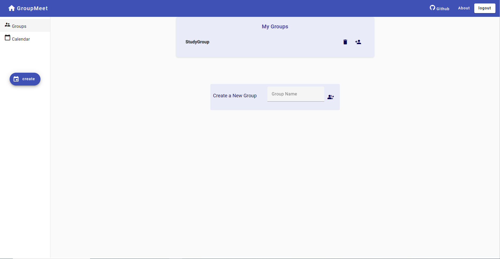

# GroupMeet
Streamlining University Student Group Meetings


## Description

Welcome to GroupMeet – your all-in-one online solution for effortlessly scheduling and coordinating university student group meetings. Designed with the specific needs of academia in mind, GroupMeet empowers students and educators to collaborate seamlessly and maximize productivity.

## Features

### Groups
- Add a new group
- Delete a group
- Add members to a group
- Delete a group member



### Calendar
- View upcoming events in different modes (month/ week/ day/ list)
- View events details by clickin on them
- Delete events


### Events
- Create a private events
- Create a group event and get the suggested time from our highly accurate algorithm


### Users
- Create user profile


## Project Architecture


## Libraries

### Back-end
                
| Technology | Function |
| ------ | ------ |
| MongoDB Atlas | Data are hosted in MongoDB Atlas database |
| NodeJS | Asynchronous JavaScript runtime environment |
| Express |  Connection with the front end is done through API developed in Express|

### Front-end

| Technology | Function |
| ------ | ------ |
| Angular | Used to make application pages |


## How to run the project

You need to have Node.js installed

### Running the Backend

```
cd groupmeet-backend
npm install
npm start
```

Output:		
```
Listening on 3001.
Connected to database
```

### Running the Frontend

```
cd groupmeet-frontend
npm install
ng serve
```

Output:		
```
** Angular Live Development Server is listening on localhost:4200, open your browser on http://localhost:4200/ **
```


## Group Members
- Mohamed Tawfik
- Ahmed Abdelbary
- Abdelrahman Eldakrony
- Osama Moharam
